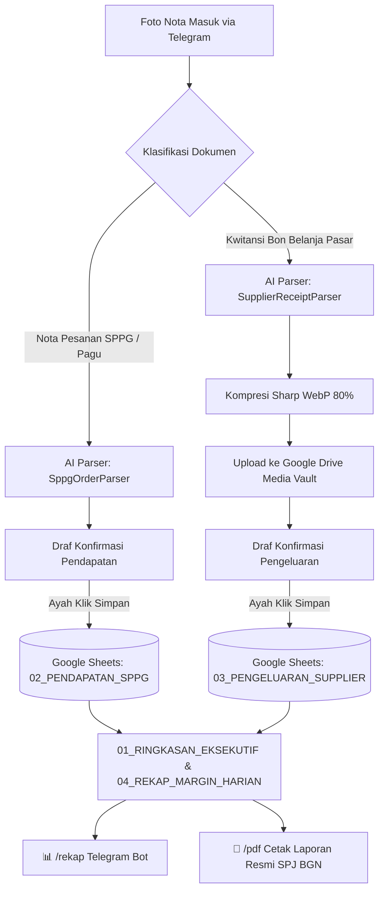

# 🍽️ IZA SPPG MBG Assistant — Badan Gizi Nasional (BGN)

[](https://www.typescriptlang.org/)
[](https://nodejs.org/)
[](https://grammy.dev/)
[](https://developers.google.com/sheets/api)
[](https://supabase.com/)
[](LICENSE)

Sistem asisten operasional dan automasi pencatatan keuangan multi-bot Telegram untuk vendor mitra **Program Makanan Bergizi Gratis (MBG)** di bawah naungan **Badan Gizi Nasional (BGN)** Republik Indonesia.

Dirancang khusus agar mudah digunakan oleh Ayah/operator lapangan di dapur SPPG, dengan pencatatan instan berbasis foto nota, perhitungan margin keuntungan harian otomatis, integrasi Google Sheets 5-Tab resmi, Google Drive Media Vault, dan ekspor dokumen PDF laporan pertanggungjawaban (SPJ).

---

## 🏛️ Konsep Inti & Alur Bisnis SPPG MBG

Dalam operasional vendor SPPG Badan Gizi Nasional, terdapat dua jenis dokumen yang dicatat secara terpisah:



1. **Nota Pesanan Bahan Makanan SPPG** (*Contoh: SPPG Patila No. 05/02/09/26*):
   - **Status**: **PENDAPATAN (Pagu / Hak Tagih ke BGN)**.
   - Berisi 20–30 item komoditas pangan (Beras, Ayam, Sayur, Buah, Bumbu) dengan spesifikasi kuantum, harga satuan pagu, dan total nilai pagu.
   - Dicatat rapi ke sheet **`02_PENDAPATAN_SPPG`**.
2. **Kwitansi / Bon Belanja Suplier Pasar** (*Contoh: Hj. Muliadi, Ayam Pasar, Mas Pandu, Best Fruit*):
   - **Status**: **PENGELUARAN RIIL (Biaya Belanja Bahan)**.
   - Foto dikompresi ke WebP 80% (maks. 1200px) dan diarsipkan ke Google Drive per folder unit dan periode (`/MBG/SPPG_ID/YYYY/MM/`).
   - Dicatat ke sheet **`03_PENGELUARAN_SUPPLIER`** lengkap dengan tautan bukti foto.
3. **Margin Keuntungan Bersih**:
   - `Margin (Laba Kotor) = Total Pagu SPPG - Total Belanja Riil Suplier`.
   - Dipantau secara *real-time* pada kartu KPI, ringkasan Telegram (`/rekap`), dan dokumen cetak SPJ BGN (`/pdf`).

---

## ✨ Fitur Utama

- 🤖 **Grammy Telegram Micro-Workers**:
  - *In-Place Message Editing*: Pembaruan draf dan konfirmasi dilakukan pada pesan yang sama tanpa mengotori ruang obrolan (*zero-spam UX*).
  - *Wizard Interaktif*: Tombol koreksi nominal atau nama toko dengan pembersihan otomatis teks pesan bantuan.
  - *Fault Isolation*: Setiap unit dapur SPPG berjalan pada proses *worker* terisolasi. Gangguan pada satu bot tidak memengaruhi bot dapur lainnya.
- 📊 **Arsitektur 5-Tab Google Sheets Anti-Lag**:
  - `01_RINGKASAN_EKSEKUTIF`: Kartu metrik KPI (Total Pagu, Realisasi Belanja, Sisa Margin, % Margin, Status Aman/Waspada).
  - `02_PENDAPATAN_SPPG`: Master data rincian pesanan bahan pangan SPPG.
  - `03_PENGELUARAN_SUPPLIER`: Log belanja harian suplier dengan link foto bukti drive.
  - `04_REKAP_MARGIN_HARIAN`: Rekapitulasi perbandingan laba kotor dan laba bersih harian.
  - `05_MASTER_DATA`: Referensi daftar suplier mitra dan unit dapur untuk validasi dropdown.
- 📁 **Google Drive Media Vault**:
  - Kompresi gambar otomatis menggunakan `sharp` (WebP kualitas 80%, resolusi seimbang 1200px) menghemat kuota Google Drive hingga 75% dan meminimalkan konsumsi memori server.
  - Struktur folder rapi berbasis waktu: `/MBG/{SPPG_ID}/{Tahun}/{Bulan}/`.
- 🧠 **Dual AI Multimodal Parser**:
  - Model utama: Google Gemini 2.5 / 2.0 Flash dengan multi-key pooling otomatis.
  - Fallback engine: `agy CLI` dengan regex auto-recovery jika format JSON terpotong.
  - Verifikasi matematis deterministik: AI menghitung ulang `qty * price == total_price` secara ketat di CPU sebelum disajikan ke user.
- 📄 **Official BGN PDF Report Generator**:
  - Ekspor dokumen SPJ formal dengan kop surat resmi Badan Gizi Nasional (BGN).
  - Strip 3 KPI keuangan: Pagu Pesanan, Belanja Riil Suplier, dan Laba Kotor/Margin.
  - Tabel rincian komoditas pangan dan blok tanda tangan legal untuk Pejabat Pembuat Komitmen & Pelaksana SPPG.
- 🛡️ **Supabase State Machine & Security**:
  - *Atomic State Locking*: Transisi status draf `PENDING -> PROCESSING -> SAVED` mencegah klik ganda (*double submission*).
  - *Whitelist Access Guard*: Hanya user ID Telegram terdaftar (Admin/Operator) yang dapat mengakses bot.
  - *Keep-Warm Scheduler*: Ping berkala ke tabel heartbeat setiap 12 jam menjaga database Supabase gratis tetap aktif 24/7.

---

## 📱 Panduan Perintah Bot Telegram

| Perintah | Deskripsi |
|---|---|
| `/start` | Menampilkan panduan penggunaan, unit SPPG aktif, atau memproses link undangan. |
| `/rekap` | Menampilkan ringkasan keuangan hari ini (Pagu, Belanja, Margin Laba, Status) beserta tombol cetak PDF. |
| `/pdf` | Mengunduh dokumen resmi Laporan SPJ Badan Gizi Nasional berformat PDF siap cetak & tanda tangan. |
| `/sheets` | Menampilkan tautan cepat membuka lembar kerja Google Sheets online unit terkait. |
| `/myid` | Memeriksa Telegram User ID, username, serta status hak akses akun Anda. |
| `/invite [Nama] [admin/member]` | Membuat link undangan instan 1x pakai (24 jam) untuk mendaftarkan operator/Ayah (khusus Admin). |

---

## 🚀 Panduan Setup & Deploy

Sistem ini mendukung dua opsi deployment produksi 24/7:
1. **Linux Cloud VPS (Ubuntu 24.04/26.04) via PM2**: Sangat hemat RAM (~140 MB), zero-downtime cluster, auto-restart.
2. **Cloud Container (Docker / Render.com)**: Menggunakan Multi-Stage Alpine Dockerfile dengan `dumb-init`.

Untuk petunjuk lengkap pengaturan database Supabase, izin Google Drive Service Account, pemasangan Google Apps Script, dan langkah deploy, silakan baca:

👉 **[SETUP.md — Panduan Setup & Deployment](SETUP.md)**

---

## 💻 Pengembangan Lokal (Development)

```bash
# 1. Kloning repositori
git clone https://github.com/iza-aa/iza-sppg-agent.git
cd iza-sppg-agent

# 2. Pasang dependensi
npm install

# 3. Siapkan file .env dan service-account.json (sesuai contoh di .env.example)
cp .env.example .env

# 4. Jalankan seluruh unit testing (7 test suites)
npm test

# 5. Kompilasi TypeScript
npm run build

# 6. Jalankan bot secara lokal
npm run dev
```

---

## 📄 Lisensi

Proyek ini dilisensikan di bawah lisensi **MIT**. Dibuat untuk mendukung kelancaran operasional program prioritas Makanan Bergizi Gratis (MBG) Badan Gizi Nasional.
