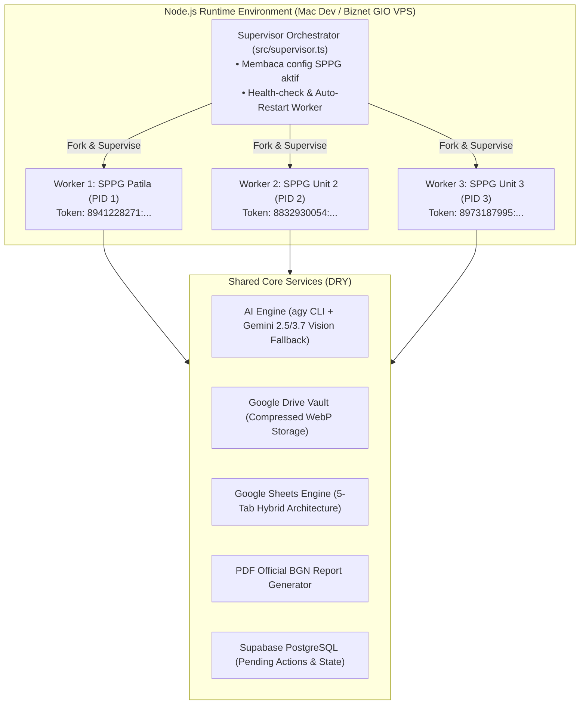

# Design Specification: IZA SPPG MBG Assistant 🍽️📊

**Tanggal**: 04 September 2026  
**Status**: Approved by User  
**Target Repository**: `https://github.com/iza-aa/iza-sppg-agent`  
**Brand Identity**: Badan Gizi Nasional (BGN) Republik Indonesia  
**Primary Color Palette**: 
- Deep Navy: `#0F2042`
- Emblem Gold: `#D4A017`
- Soft Sky Blue: `#90C7DE`
- Slate White: `#F8FAFC`
- Alert Green (Surplus): `#2E7D32`
- Alert Yellow (Sesuai Pagu): `#F59E0B`
- Alert Red (Defisit / Over-budget): `#C62828`

---

## 1. Executive Summary & Domain Logic

Sistem ini dirancang khusus untuk memfasilitasi vendor operasional penyedia makanan pada program **Makanan Bergizi Gratis (MBG)** di bawah naungan **Badan Gizi Nasional (BGN)**. 

### Alur Finansial Inti (Akuntansi Vendor MBG):
1. **Nota Pesanan Bahan Makanan SPPG** = **PENDAPATAN (Plafon Anggaran / Hak Tagih)**
   - Diterbitkan oleh Satuan Pelayanan Pemenuhan Gizi (SPPG) lokal (contoh: *SPPG Patila, Luwu Utara*).
   - Memuat nomor pesanan, tanggal tiba, serta daftar rincian bahan (hingga 20+ item), volume (ekor, kg, jerigen, liter), pagu harga, dan total alokasi dana (misal: Rp 29.581.000).
   - Dicatat ke tab `02_PENDAPATAN_SPPG`.
2. **Invoice / Kwitansi Supplier Pasar** = **PENGELUARAN (Realisasi Belanja Riil)**
   - Diterbitkan oleh suplier pasar/peternak/toko (contoh: *Ayam Pasar, Hj Muliadi, Mas Pandu, Best Fruit*).
   - Memuat belanja aktual yang dibayarkan vendor. Foto fisik diarsipkan ke Google Drive dalam format terkompresi WebP (80% kualitas, max 1200px lebar).
   - Dicatat ke tab `03_PENGELUARAN_SUPPLIER` dengan formula tautan rapi `=HYPERLINK(url, "📸 Lihat Nota")`.
3. **Rekapitulasi Margin Keuntungan Bersih**:
   - `Laba Kotor (Margin Rp) = Total Plafon SPPG - Total Belanja Supplier`
   - `% Efisiensi / Margin = (Margin Rp / Total Plafon SPPG) * 100%`
   - Dapat dipantau langsung dari Telegram, Google Sheets, maupun diekspor ke dokumen PDF resmi SPJ.

---

## 2. Arsitektur Sistem (Process-Isolated Micro-Workers)

Untuk memastikan bahwa kendala pada satu bot (misal: SPPG Patila) tidak mengganggu bot SPPG lainnya, sistem mengadopsi arsitektur **Hybrid Supervisor & Micro-Workers**:



### Keunggulan Arsitektur:
- **Fault Isolation**: Jika Worker 1 mengalami error parsing atau timeout Telegram, Worker 2 dan Worker 3 tetap berjalan 100% normal. Supervisor akan otomatis me-restart Worker 1 dalam hitungan detik.
- **Single Source of Truth**: Seluruh modul AI, parser, Google API, dan database tersentralisasi di folder `src/core/`, sehingga tidak ada duplikasi kode.
- **Scalable**: Menambah SPPG ke-4 atau ke-5 cukup menambahkan konfigurasi di `.env` tanpa menulis ulang aplikasi.

---

## 3. Desain Google Spreadsheet Jangka Panjang (Hybrid 5-Tab Architecture)

Setiap unit SPPG memiliki 1 Google Spreadsheet khusus dengan arsitektur 5 tab terstruktur, ditambah 1 Master Dashboard terpusat untuk Ayah.

```
[SPREADSHEET SPPG PATILA]
 ├── 1. 📊 01_RINGKASAN_EKSEKUTIF    (Sticky KPI Cards, grafik alokasi, status margin)
 ├── 2. 🟢 02_PENDAPATAN_SPPG        (Data seluruh Nota Pesanan dari BGN)
 ├── 3. 🔴 03_PENGELUARAN_SUPPLIER   (Data seluruh nota belanja riil + link foto Drive)
 ├── 4. ⚖️ 04_REKAP_MARGIN_HARIAN    (Komparasi otomatis: Pagu vs Belanja per tanggal/SPPG)
 └── 5. ⚙️ 05_MASTER_DATA            (Daftar resmi supplier, bahan baku, satuan baku)
```

### 3.1 Rincian Struktur Tab

#### Tab 1: `01_RINGKASAN_EKSEKUTIF`
*Warna Tab: Deep Navy (`#0F2042`)*
- **Baris 1–4 (Freeze Rows / Sticky KPI Cards)**:
  - Card 1: `TOTAL PAGU PENDAPATAN SPPG` (Format: `Rp #,##0`, Background: Deep Navy `#0F2042`, Text: Gold `#D4A017`)
  - Card 2: `TOTAL REALISASI BELANJA PASAR` (Format: `Rp #,##0`, Background: Slate `#1E293B`, Text: White `#FFFFFF`)
  - Card 3: `TOTAL MARGIN BERSIH (LABA KOTOR)` (Format: `Rp #,##0` & `%`, Background: Forest Green `#14532D`, Text: White `#FFFFFF`)
- **Area Bawah**:
  - Grafik lingkaran (*Pie Chart*): Porsi pengeluaran per supplier (Ayam Pasar vs Hj Muliadi vs Mas Pandu).
  - Tabel 10 transaksi terakhir dengan indikator status efisiensi.

#### Tab 2: `02_PENDAPATAN_SPPG`
*Warna Tab: Soft Sky Blue (`#90C7DE`)*
- Kolom:
  - `A: ID Transaksi` (Format: `SPPG-ORD-YYYYMMDD-XXX`)
  - `B: Tanggal Pesanan` (YYYY-MM-DD)
  - `C: Tanggal Tiba Bahan` (YYYY-MM-DD)
  - `D: No SPPG` (contoh: `05/02/09/26`)
  - `E: Uraian Bahan Makanan` (Ayam, Tempe, Minyak Sawit, Wortel, dll.)
  - `F: Kuantitas` (angka numerik)
  - `G: Satuan` (Ekor, KG, Jerigen, Liter, Keranjang, Ikat, Bungkus)
  - `H: Harga Pagu SPPG (Rp)` (Format Currency `Rp #,##0`)
  - `I: Total Pagu (Rp)` (Nilai dihitung pasti)
  - `J: Target Supplier` (Dropdown referensi ke `05_MASTER_DATA`)
  - `K: Status Realisasi` (`LENGKAP` / `SEBAGIAN` / `PENDING`)
  - `L: Catatan Tambahan`

#### Tab 3: `03_PENGELUARAN_SUPPLIER`
*Warna Tab: Crimson Red (`#C62828`)*
- Kolom:
  - `A: ID Transaksi` (Format: `SUPP-EXP-YYYYMMDD-XXX`)
  - `B: Tanggal Transaksi` (YYYY-MM-DD)
  - `C: No SPPG Ref` (Terkait ke nomor pesanan SPPG mana)
  - `D: Nama Supplier` (Dropdown referensi ke `05_MASTER_DATA`)
  - `E: Uraian Barang Belanja`
  - `F: Kuantitas Riil`
  - `G: Satuan`
  - `H: Harga Beli Riil (Rp)`
  - `I: Total Bayar (Rp)`
  - `J: Link Bukti Nota GDrive` (Formula: `=HYPERLINK(url, "📸 Lihat Nota")`)
  - `K: Penginput / PIC` (ID / Nama Telegram)
  - `L: Keterangan / Catatan Audit`

#### Tab 4: `04_REKAP_MARGIN_HARIAN`
*Warna Tab: Emblem Gold (`#D4A017`)*
- Menghubungkan Tab 2 dan Tab 3 berdasarkan `Tanggal Tiba` dan `No SPPG`:
  - `Kolom A: Tanggal / Periode`
  - `Kolom B: No SPPG`
  - `Kolom C: Total Plafon SPPG (Rp)`
  - `Kolom D: Total Belanja Supplier (Rp)`
  - `Kolom E: Margin Bersih (Rp)` (`=C - D`)
  - `Kolom F: % Margin Efisiensi` (`=E / C`)
  - `Kolom G: Status Badge`:
    - 🟢 **HEMAT / SURPLUS** (Margin >= 15%)
    - 🟡 **SESUAI PAGU** (Margin 5% – 14.9%)
    - 🔴 **OVER-BUDGET** (Margin < 5% atau Negatif)

#### Tab 5: `05_MASTER_DATA`
*Warna Tab: Slate Gray (`#64748B`)*
- Kolom A: **Daftar Resmi Supplier** (`Hj Muliadi`, `Ayam Pasar`, `Mas Pandu`, `Best Fruit`)
- Kolom B: **Daftar Satuan Baku** (`Ekor`, `KG`, `Jerigen`, `Keranjang`, `Liter`, `Ikat`, `Bungkus`, `Pcs`)
- Kolom C: **Daftar Kategori Bahan** (`Protein Hewani`, `Protein Nabati`, `Sayuran Segar`, `Buah Segar`, `Bahan Pokok`, `Bumbu Dapur`, `Susu & Pelengkap`, `Kemasan/Gas/Operasional`)

---

### 3.2 Google Apps Script (`google-apps-script/kode.gs`)
File `kode.gs` ditanamkan langsung di dalam spreadsheet untuk memberikan menu khusus `[⚡ MENU KELOLA SPPG]` dengan fungsi:
1. **`formatBgnDesign()`**: Memulihkan seluruh format visual, header Navy `#0F2042`, zebra rows, border emas tipis, dan format Rupiah `Rp #,##0`.
2. **`lockPreviousMonths()`**: Mengunci baris data bulan lalu yang telah selesai SPJ agar tidak sengaja terhapus/terubah oleh staf.
3. **`sendDailySummaryToTelegram()`**: Mengirimkan rangkuman omset dan margin hari ini langsung ke Telegram Ayah.
4. **`archiveYearlyData()`**: Membekukan data tahun anggaran lama ke spreadsheet arsip saat pergantian tahun.

---

## 4. Prinsip Ketahanan Jangka Panjang (Longevity & Anti-Fragility)

1. **Google Drive Anti-Quota (WebP 80% Max 1200px)**:
   - Foto nota diperkecil dari 6MB menjadi ~80 KB – 150 KB menggunakan `sharp`.
   - Kuota gratis 15 GB mampu menampung lebih dari 100.000 nota (tahan bertahun-tahun).
   - Struktur folder otomatis bertingkat: `/MBG/[SPPG_ID]/[Tahun]/[Bulan]/Supplier/`.
2. **Human-in-the-Loop & CPU Math Check**:
   - AI tidak pernah langsung menulis ke Sheets tanpa konfirmasi Ayah.
   - Backend memverifikasi rumus matematis: `Σ (qty * price) == total_amount` untuk mendeteksi halusinasi angka pada nota buram.
3. **Persistent State & Obsolete Keyboard Cleanup**:
   - Draf transaksi disimpan di Supabase (`pending_agent_actions`) dengan TTL 10 menit (tahan restart server).
   - Tombol draf lama otomatis dibersihkan (`clearPreviousKeyboard`) untuk mencegah dobel input.
4. **Supabase Heartbeat Ping**:
   - Cron job mingguan ringan (`SELECT 1`) menjaga proyek Supabase free-tier tidak pernah auto-pause selama libur semester sekolah.

---

## 5. Desain Ekspor Dokumen Resmi PDF SPJ

Format PDF dihasilkan langsung oleh library `pdfkit` dengan estetika resmi Badan Gizi Nasional:
- **Kop Dokumen**:
  - Logo BGN dan teks resmi Satuan Pelayanan Pemenuhan Gizi (SPPG).
- **Summary Strip**:
  - 3 kotak KPI (Plafon SPPG, Belanja Supplier, Sisa Margin Rp dan %).
- **Tabel Belanja**:
  - Rincian pembelian per suplier dengan format rapi dan penomoran otomatis.
- **Kolom Pengesahan**:
  - Tanda tangan Kepala SPPG dan Rekanan Vendor MBG.

---

## 6. Alur Interaksi Telegram Bot (UX Flow)

```
[Skenario 1: Ayah Kirim Foto Nota Pesanan SPPG]
Ayah ➔ Kirim Foto Nota SPPG
Bot  ➔ 🔍 "Sedang menganalisis dokumen Nota Pesanan SPPG..."
Bot  ➔ 📋 Menampilkan Draf Hasil Ekstraksi:
       "📍 SPPG: Patila, Luwu Utara
        📄 No Nota: 05/02/09/26
        📅 Tanggal Tiba: 03 September 2026
        🍲 Jumlah Bahan: 22 Item
        💰 Total Plafon: Rp 29.581.000
        
        [Rincian 5 Bahan Terbesar]:
        1. Ayam: 248 Ekor @ Rp 60.000 = Rp 14.880.000
        2. Kelengkeng: 15 Keranjang @ Rp 380.000 = Rp 5.700.000
        3. Minyak Sawit: 14 Jerigen @ Rp 125.000 = Rp 1.750.000
        4. Tempe: 105 KG @ Rp 15.000 = Rp 1.575.000
        5. Kentang: 80 KG @ Rp 18.000 = Rp 1.440.000
        ... (17 item lainnya)"
       [Tombol Inline]:
       [✅ Simpan ke Pendapatan] [✏️ Ubah Data] [❌ Batalkan]

[Skenario 2: Ayah / Tim Kirim Foto Nota Belanja Supplier]
Ayah ➔ Kirim Foto Nota Toko (misal: Bon Hj Muliadi)
Bot  ➔ 📸 "Foto nota berhasil diarsipkan ke Google Drive!"
Bot  ➔ 🧾 "Terdeteksi Belanja Supplier:
        🏪 Supplier: Hj Muliadi
        📅 Tanggal: 03 Sept 2026
        📦 Item: Minyak (14 jerigen), Wortel (75 kg), Bawang, Bumbu
        💵 Total Belanja: Rp 8.920.000"
       [Tombol Inline]:
       [✅ Simpan Pengeluaran] [🔗 Linkkan ke SPPG 05/02/09/26] [❌ Batal]

[Skenario 3: Ayah Cek Rekap & Cetak PDF]
Ayah ➔ Klik tombol [📊 Cek Margin Hari Ini] atau ketik "/rekap"
Bot  ➔ "📊 Laporan SPPG Patila (03 Sept 2026):
        🟢 Plafon Pendapatan : Rp 29.581.000
        🔴 Realisasi Belanja : Rp 24.150.000
        ----------------------------------
        💎 Margin Bersih     : Rp 5.431.000 (18.36%)
        
        [📄 Download Laporan PDF Resmi] [🌐 Buka Google Sheets]"
```
