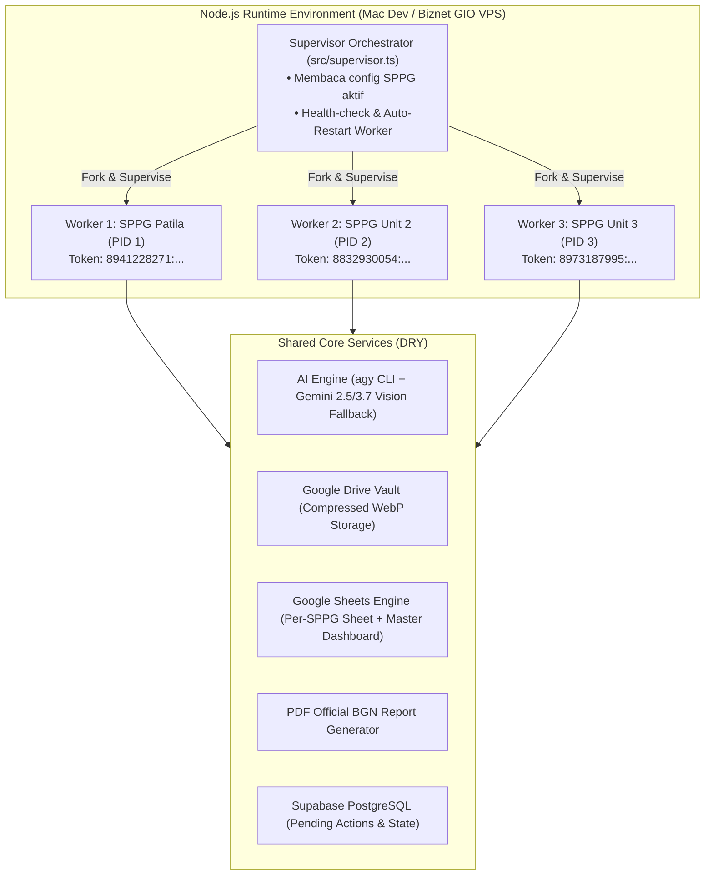

# Design Specification: IZA SPPG MBG Assistant 🍽️📊

**Tanggal**: 04 September 2026  
**Status**: Draft for Approval  
**Target Repository**: `https://github.com/iza-aa/iza-sppg-agent`  
**Brand Identity**: Badan Gizi Nasional (BGN) Republik Indonesia  
**Primary Color Palette**: 
- Deep Navy: `#0F2042`
- Emblem Gold: `#D4A017`
- Soft Sky Blue: `#90C7DE`
- Slate White: `#F8FAFC`
- Alert Green (Surplus): `#2E7D32`
- Alert Red (Defisit): `#C62828`

---

## 1. Executive Summary & Domain Logic

Sistem ini dirancang khusus untuk memfasilitasi vendor operasional penyedia makanan pada program **Makanan Bergizi Gratis (MBG)** di bawah naungan **Badan Gizi Nasional (BGN)**. 

### Alur Finansial Inti (Akuntansi Vendor MBG):
1. **Nota Pesanan Bahan Makanan SPPG** = **PENDAPATAN (Plafon Anggaran / Hak Tagih)**
   - Diterbitkan oleh Satuan Pelayanan Pemenuhan Gizi (SPPG) lokal (contoh: *SPPG Patila, Luwu Utara*).
   - Memuat nomor pesanan, tanggal tiba, serta daftar rincian bahan (hingga 20+ item), volume (ekor, kg, jerigen, liter), pagu harga, dan total alokasi dana (misal: Rp 29.581.000).
   - Dicatat ke tab `PENDAPATAN_SPPG`.
2. **Invoice / Kwitansi Supplier Pasar** = **PENGELUARAN (Realisasi Belanja Riil)**
   - Diterbitkan oleh suplier pasar/peternak/toko (contoh: *Ayam Pasar, Hj Muliadi, Mas Pandu, Best Fruit*).
   - Memuat belanja aktual yang dibayarkan vendor. Foto fisik diarsipkan ke Google Drive.
   - Dicatat ke tab `PENGELUARAN_SUPPLIER`.
3. **Rekapitulasi Margin Keuntungan Bersih**:
   - `Laba Kotor (Margin Rp) = Total Plafon SPPG - Total Belanja Supplier`
   - `% Efisiensi / Margin = (Margin Rp / Total Plafon SPPG) * 100%`
   - Dapat dipantau langsung dari Telegram, Google Sheets, maupun diekspor ke PDF resmi.

---

## 2. Arsitektur Sistem (Process-Isolated Micro-Workers)

Untuk memastikan bahwa kendala pada satu bot (misal: SPPG Patila) tidak mengganggu bot SPPG lainnya, sistem mengadopsi arsitektur **Hybrid Supervisor & Micro-Workers**:



### Keunggulan Arsitektur:
- **Fault Isolation**: Jika Worker 1 mengalami error parsing atau timeout Telegram, Worker 2 dan Worker 3 tetap berjalan 100% normal. Supervisor akan otomatis me-restart Worker 1 dalam hitungan detik.
- **Single Source of Truth**: Seluruh modul AI, parser, Google API, dan database tersentralisasi di folder `src/core/`, sehingga tidak ada duplikasi kode.
- **Scalable**: Menambah SPPG ke-4 atau ke-5 cukup menambahkan konfigurasi di `.env` tanpa menulis ulang aplikasi.

---

## 3. Desain Google Spreadsheet & Google Apps Script (`kode.gs`)

Setiap unit SPPG memiliki 1 Google Spreadsheet khusus, ditambah 1 Master Dashboard terpusat untuk Ayah.

### 3.1 Struktur Tab Spreadsheet Per SPPG

#### Tab 1: `PENDAPATAN_SPPG`
*Warna Tab: Deep Navy (`#0F2042`)*
- Kolom:
  - `A: ID Transaksi` (UUID / SPPG-ORD-YYYYMMDD-XXX)
  - `B: Tanggal Pesanan` (YYYY-MM-DD)
  - `C: Tanggal Tiba Bahan` (YYYY-MM-DD)
  - `D: No SPPG` (contoh: `05/02/09/26`)
  - `E: Uraian Bahan Makanan` (contoh: Ayam, Tempe, Minyak Sawit)
  - `F: Kuantitas` (angka numerik)
  - `G: Satuan` (Ekor, KG, Jerigen, Liter, Keranjang, dll.)
  - `H: Harga Pagu SPPG (Rp)`
  - `I: Total Pagu (Rp)` (`=F*H`)
  - `J: Target Supplier` (Hj Muliadi, Ayam Pasar, dll.)
  - `K: Status Realisasi` (`LENGKAP` / `SEBAGIAN` / `PENDING`)
  - `L: Catatan Tambahan`

#### Tab 2: `PENGELUARAN_SUPPLIER`
*Warna Tab: Crimson Red (`#C62828`)*
- Kolom:
  - `A: ID Transaksi` (UUID / SUPP-EXP-YYYYMMDD-XXX)
  - `B: Tanggal Transaksi` (YYYY-MM-DD)
  - `C: No SPPG Ref` (Terkait ke pesanan SPPG mana)
  - `D: Nama Supplier` (Hj Muliadi, Ayam Pasar, Mas Pandu, dll.)
  - `E: Uraian Barang`
  - `F: Kuantitas Riil`
  - `G: Satuan`
  - `H: Harga Beli Riil (Rp)`
  - `I: Total Bayar (Rp)`
  - `J: Link Bukti Nota GDrive` (URL langsung ke file foto di Google Drive)
  - `K: Penginput / PIC`
  - `L: Keterangan`

#### Tab 3: `REKAP_MARGIN_HARIAN`
*Warna Tab: Emblem Gold (`#D4A017`)*
- Menghubungkan Tab 1 dan Tab 2 berdasarkan `Tanggal Tiba` / `No SPPG`:
  - `Plafon Pendapatan SPPG (Rp)`
  - `Realisasi Belanja Supplier (Rp)`
  - `Margin / Laba Bersih (Rp)` (`=Plafon - Realisasi`)
  - `% Margin` (`=Margin / Plafon`)
  - Status Evaluasi: `HEMAT (HIJAU)` / `SESUAI PAGU (KUNING)` / `OVER-BUDGET (MERAH)`

---

### 3.2 Google Apps Script (`kode.gs`)
File `kode.gs` akan ditanamkan ke dalam Spreadsheet untuk:
1. **Otomatisasi Formatting**: Menerapkan styling warna resmi Badan Gizi Nasional (Navy Header, Zebra Table, Border Emas, Format Mata Uang `Rp #,##0`).
2. **Formula Auto-Fill**: Menghitung otomatis kolom `Total`, `Margin`, dan status audit.
3. **Custom Menu di Google Sheets**:
   - `[⚡ Menu SPPG]` ➔ `Format Ulang Tabel`
   - `[⚡ Menu SPPG]` ➔ `Hitung Ulang Margin Harian`
   - `[⚡ Menu SPPG]` ➔ `Kirim Rekap ke Telegram Ayah`

---

## 4. Desain Ekspor Laporan Resmi PDF

Bot Telegram dapat mengekspor rekap dalam bentuk dokumen **PDF Resmi SPJ / Laporan Vendor**:
- **Kop Dokumen**:
  - Logo Badan Gizi Nasional di pojok kiri atas.
  - Teks Kop Resmi:  
    **SATUAN PELAYANAN PEMENUHAN GIZI (SPPG) [NAMA UNIT]**  
    *Badan Gizi Nasional Republik Indonesia*  
    Laporan Rekapitulasi Pembelanjaan & Realisasi Bahan Makanan
- **Blok Informasi**: No SPPG, Periode/Tanggal, Total Porsi/Anggaran.
- **Tabel Ringkasan Keuangan**:
  - Total Plafon Anggaran SPPG: `Rp XX.XXX.XXX`
  - Total Realisasi Supplier: `Rp XX.XXX.XXX`
  - Margin Efisiensi Vendor: `Rp XX.XXX.XXX (XX%)`
- **Tabel Rincian Pembelian per Supplier**:
  - Pengelompokan belanja per suplier (Ayam Pasar, Hj Muliadi, dll.).
- **Tanda Tangan Pengesahan**:
  - Kolom Tanda Tangan Kepala SPPG.
  - Kolom Tanda Tangan Rekanan / Vendor MBG.

Dokumen digenerate langsung oleh backend menggunakan library `pdfkit` dan dikirimkan sebagai file `.pdf` ke chat Telegram Ayah dalam hitungan detik.

---

## 5. Alur Interaksi Telegram Bot (UX Flow)

```
[Skenario 1: Ayah Kirim Foto Nota Pesanan SPPG]
Ayah ➔ Kirim Foto Nota SPPG
Bot  ➔ 🔍 "Sedang menganalisis dokumen Nota Pesanan SPPG..."
Bot  ➔ 📋 Menampilkan Draf Hasil Ekstraksi:
       "📍 SPPG: Patila, Luwu Utara
        📄 No Nota: 05/02/09/26
        📅 Tanggal Tiba: 03 September 2026
        🍲 Jumlah Bahan: 22 Item
        💰 Total Plafon: Rp 29.581.000
        
        [Rincian 5 Bahan Terbesar]:
        1. Ayam: 248 Ekor @ Rp 60.000 = Rp 14.880.000
        2. Kelengkeng: 15 Keranjang @ Rp 380.000 = Rp 5.700.000
        3. Minyak Sawit: 14 Jerigen @ Rp 125.000 = Rp 1.750.000
        4. Tempe: 105 KG @ Rp 15.000 = Rp 1.575.000
        5. Kentang: 80 KG @ Rp 18.000 = Rp 1.440.000
        ... (17 item lainnya)"
       [Tombol Inline]:
       [✅ Simpan ke Pendapatan] [✏️ Ubah Data] [❌ Batalkan]

[Skenario 2: Ayah / Tim Kirim Foto Nota Belanja Supplier]
Ayah ➔ Kirim Foto Nota Toko (misal: Bon Hj Muliadi)
Bot  ➔ 📸 "Foto nota berhasil diarsipkan ke Google Drive!"
Bot  ➔ 🧾 "Terdeteksi Belanja Supplier:
        🏪 Supplier: Hj Muliadi
        📅 Tanggal: 03 Sept 2026
        📦 Item: Minyak (14 jerigen), Wortel (75 kg), Bawang, Bumbu
        💵 Total Belanja: Rp 8.920.000"
       [Tombol Inline]:
       [✅ Simpan Pengeluaran] [🔗 Linkkan ke SPPG 05/02/09/26] [❌ Batal]

[Skenario 3: Ayah Cek Rekap & Cetak PDF]
Ayah ➔ Klik tombol [📊 Cek Margin Hari Ini] atau ketik "/rekap"
Bot  ➔ "📊 Laporan SPPG Patila (03 Sept 2026):
        🟢 Plafon Pendapatan : Rp 29.581.000
        🔴 Realisasi Belanja : Rp 24.150.000
        ----------------------------------
        💎 Margin Bersih     : Rp 5.431.000 (18.36%)
        
        [📄 Download Laporan PDF Resmi] [🌐 Buka Google Sheets]"
```

---

## 6. Rencana Tahapan Eksekusi

1. **Fase 1: Inisialisasi Repository & Fondasi Standar**
   - Inisialisasi git pada direktori kerja, hubungkan ke `https://github.com/iza-aa/iza-sppg-agent`.
   - Setup `package.json`, `tsconfig.json`, `vitest` config, linter, dan struktur folder.
2. **Fase 2: Core Database & AI Parser**
   - Setup Supabase migration (tabel `sppg_orders`, `sppg_order_items`, `supplier_expenses`, `pending_actions`, `users`).
   - Ekstraktor dokumen multimodal (`sppg-order.parser.ts` dan `supplier-receipt.parser.ts`) bertenaga `agy CLI` dengan fallback ke Gemini Vision.
3. **Fase 3: Google Drive & Google Sheets Integration + `kode.gs`**
   - Google Drive uploader dengan kompresi WebP.
   - Google Sheets adapter untuk multi-SPPG dan Master Dashboard.
   - Pembuatan script `kode.gs` dan dokumentasi pemasangannya.
4. **Fase 4: Micro-Worker Supervisor & Grammy Bot Handler**
   - Implementasi `src/supervisor.ts` dan `src/worker.ts`.
   - Setup 3 token bot untuk pengujian terisolasi.
   - Fitur generator PDF resmi Badan Gizi Nasional via `pdfkit`.
5. **Fase 5: Dokumentasi Lengkap & Testing Lokal (Mac)**
   - Penyusunan `SETUP.md` komprehensif (panduan dari nol: BotFather, Supabase, Google Service Account, `kode.gs`, hingga jalankan di Mac).
   - Pengujian end-to-end lokal di Mac menggunakan data nyata foto SPPG Patila.
   - Commit dan push ke repository GitHub.
